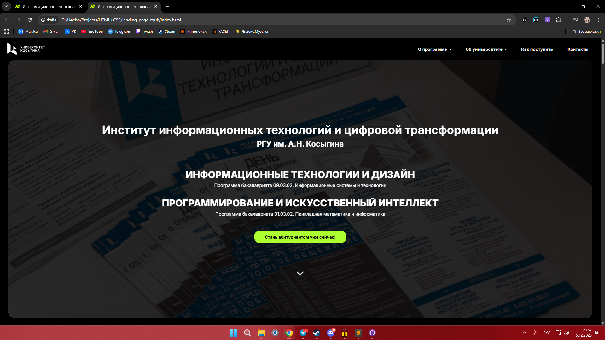
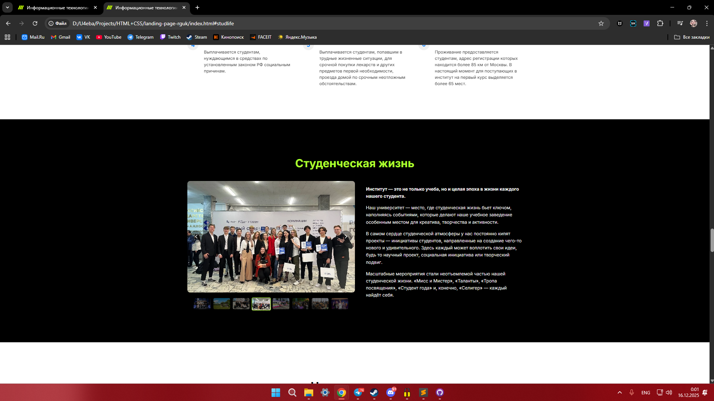
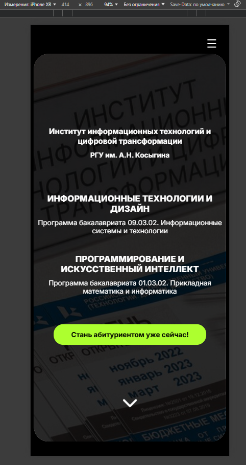
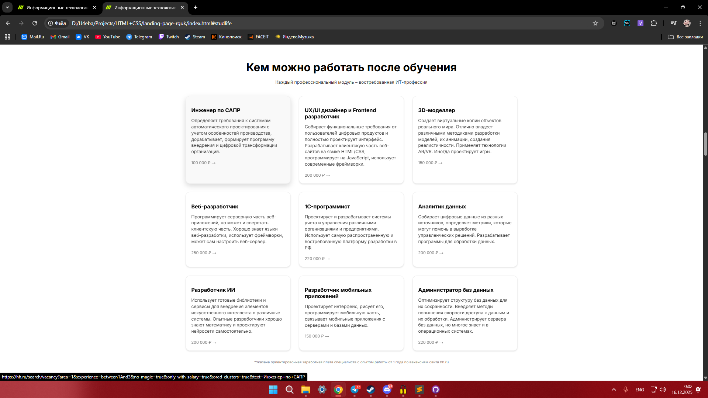

# Лендинг для Института ИТ и цифровой трансформации РГУ им. А.Н. Косыгина

**Промо-сайт** для образовательных программ «Информационные технологии и дизайн» и «Программирование и искусственный интеллект».



## 📌 О проекте

Практическое задание в рамках производственной практики в **РГУ им. А.Н. Косыгина**. Задача — разработать современный, адаптивный лендинг для привлечения абитуриентов, повторяющий структуру и контент существующего официального сайта института.

**Ключевой результат:** Работа получила высокую оценку преподавателя, который отметил точность реализации ("1в1") и привлёк меня к помощи в другом, более сложном проекте.

## 🛠️ Технологии

*   **HTML5** — семантическая, валидная разметка.
*   **CSS3** — Flexbox, Grid, адаптивная вёрстка, CSS-анимации, плавные переходы.
*   **Чистый JavaScript (Vanilla JS)** — реализация без сторонних библиотек:
    *   Слайдеры галереи (студенческая жизнь, инфраструктура) с превью и модальным окном.
    *   Мобильное меню-бургер с анимацией открытия/закрытия.
    *   Плавная прокрутка к якорям.
    *   Анимации появления элементов при скролле (Intersection Observer).
    *   Интерактивные выпадающие меню.
*   **Методология:** БЭМ-подобная организация CSS (использованы модификаторы и элементы).
*   **Адаптивность:** Полноценная работа на мобильных устройствах, планшетах и десктопах.

## ✨ Функциональность и особенности

*   **Многостраничность в одном файле:** Полноценный сайт с 15+ секциями, реализованный на одной HTML-странице с навигацией по якорям.
*   **Сложные интерактивные компоненты:**
    *   Два независимых слайдера изображений с навигацией, превью и полноэкранным просмотром.
    *   Многоуровневое меню (для десктопа и мобильной версии).
    *   Карточки профессий со ссылками на актуальные вакансии hh.ru.
    *   Интерактивная форма для потенциальных абитуриентов.
*   **Оптимизация и детали:**
    *   Плавные параллакс-эффекты и анимации появления.
    *   Фиксированная шапка.
    *   Оптимизированные изображения.
    *   Кроссбраузерность.

## 🚀 Запуск проекта

Проект статический. Чтобы посмотреть его локально:

1.  Склонируй репозиторий:
    ```bash
    git clone https://github.com/bukabtw/landing-page-rguk.git
    ```
2.  Открой файл `index.html` в любом современном браузере (Chrome, Firefox, Edge).

Или просто перейди по ссылке на **GitHub Pages** (ниже).

## 📁 Структура проекта

landing-page-rguk/
├── index.html # Главная и единственная HTML-страница
├── style.css # Основной файл стилей
├── README.md
├── addons/ # Папка с изображениями (логотипы, фото, иконки)
│ ├── background.jpg
│ ├── 1.jpg
│ └── ...
└── screenshots/ # Папка для скриншотов проекта

## 📸 Скриншоты

*Секция "Студенческая жизнь" с работающим слайдером*


*Адаптивный дизайн на мобильном устройстве*


*Секция "Кем можно работать" с интерактивными карточками*


## 🔗 Ссылки

*   **Демо (GitHub Pages):** [Посмотреть работающий сайт](https://bukabtw.github.io/landing-page-rguk/)
*   **Исходный сайт-образец:** [https://itdt-rsu.ru/](https://itdt-rsu.ru/)

---
**Автор:** [Кирилл Букарев]
[http://t.me/bukabtw] | [bukarev.k11@gmail.com]

*Выполнено в 2024 году в рамках производственной практики.*